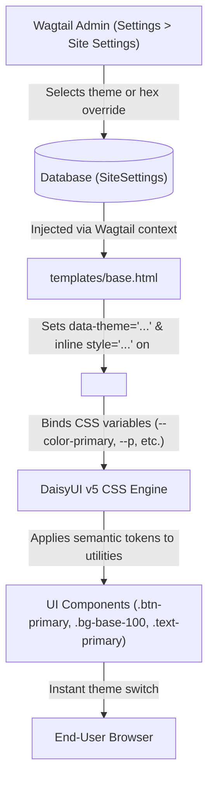

# Theme & Styling Guide

This guide explains how the dynamic theming and styling architecture works in the Nakashara Institutional CMS, and provides step-by-step instructions for developers to add, remove, or customize themes and component styles.

---

## 1. Architecture Overview

Nakashara CMS uses a modern, token-driven theming architecture combining **Wagtail Site Settings**, **Tailwind CSS v4**, and **DaisyUI v5**.

The core principle is **zero hardcoded brand colors in templates**. All UI components consume semantic CSS variables and tokens (`primary`, `secondary`, `accent`, `base-100`, `base-content`, etc.). When a theme changes in the Wagtail Admin, the entire site instantly reflects the new color palette without recompiling CSS or redeploying code.



### Key Components

1. **`apps.site_settings.models.SiteSettings`**:
   A Wagtail `BaseSiteSetting` registered model providing administrative controls:
   - `theme`: A dropdown selection from curated themes (e.g., `corporate`, `emerald`, `nord`, etc.).
   - `custom_primary_color`: An optional hex code string (e.g., `#1E40AF`) for fine-grained brand color overrides.
   - `custom_accent_color`: An optional hex code string (e.g., `#D97706`) for secondary/accent overrides.

2. **Root HTML Injection (`templates/base.html`)**:
   The root `<html>` element dynamically receives the `data-theme` attribute and any inline CSS variable overrides:
   ```html
   <html lang="en" data-theme="{{ site_settings.theme|default:'corporate' }}" class="h-full"
     
       style="--color-primary: {{ site_settings.custom_primary_color }}; --p: {{ site_settings.custom_primary_color }};--color-secondary: {{ site_settings.custom_accent_color }}; --s: {{ site_settings.custom_accent_color }}; --color-accent: {{ site_settings.custom_accent_color }}; --a: {{ site_settings.custom_accent_color }};"
     >
   ```

3. **DaisyUI v5 Plugin Configuration (`theme/static_src/src/styles.css`)**:
   Uses the Tailwind v4 `@plugin` directive to include themes:
   ```css
   @import "tailwindcss";
   @plugin "daisyui" {
     themes: all;
   }

   @source "../../../templates/**/*.html";
   @source "../../../apps/**/*.py";
   @source "../../templates/**/*.html";
   ```

4. **Semantic Token Consumption in Templates**:
   Templates rely exclusively on semantic classes:
   - `bg-primary`, `text-primary`, `text-primary-content`
   - `bg-secondary`, `text-secondary`, `badge-secondary`
   - `bg-base-100` (main surface), `bg-base-200` (cards/sub-surfaces), `bg-base-300` (borders/dividers)
   - `text-base-content` (main text), `text-base-content/70` (muted text)
   - `btn-primary`, `btn-secondary`, `btn-outline`

---

## 2. Pre-configured Themes

The system ships with 9 curated themes suited for institutional and academic use:

| Theme Name | Style Description | Primary / Base Tone | Best For |
|---|---|---|---|
| `corporate` *(Default)* | Clean, modern blue, slate, crisp borders | Deep Navy / Clean White | General institutional portals, university headquarters |
| `emerald` | Academic forest green, mint accents | Deep Emerald / Light Cream | Sciences, agriculture, ecological & forestry institutes |
| `nord` | Arctic slate, muted frost blues | Nord Slate / Snow Flurry | Technology, medical research, northern institutes |
| `winter` | Crisp cyan, bright icy highlights | Crisp Indigo / Ice White | Clinical institutions, hospitals, labs |
| `business` | High-contrast corporate dark mode | Deep Charcoal / Bright Amber | Executive boards, business schools, foundation offices |
| `night` | Ultra-deep dark blue palette | Deep Cobalt / Dark Indigo | Developer docs, astronomy, physics departments |
| `autumn` | Warm terracotta, bronze, cream | Earth Rust / Warm Cream | Humanities, historical archives, arts faculties |
| `luxury` | Deep obsidian, champagne gold | Obsidian / Burnished Gold | Law faculties, distinguished honors, endowments |
| `light` | Bright, clean minimalist palette | Sky Blue / Crisp White | Standard high-readability public information |

---

## 3. How to Add a New Theme

Follow these steps to add a new theme to the CMS.

### Step 1: Choose or Define Your Theme

#### Option A: Using a Built-in DaisyUI Theme
DaisyUI v5 provides built-in themes including:
`light`, `dark`, `cupcake`, `bumblebee`, `emerald`, `corporate`, `synthwave`, `retro`, `cyberpunk`, `valentine`, `halloween`, `garden`, `forest`, `aqua`, `lofi`, `pastel`, `fantasy`, `wireframe`, `black`, `luxury`, `dracula`, `cmyk`, `autumn`, `business`, `acid`, `lemonade`, `night`, `coffee`, `winter`, `dim`, `nord`, `sunset`, `caramellatte`, `abyssal`, `silk`.

If you select an existing DaisyUI theme (e.g. `dracula` or `dim`), proceed directly to Step 2.

#### Option B: Defining a Custom Institutional Theme
To define a custom theme with specific brand colors, open `theme/static_src/src/styles.css` and define the custom theme in CSS:

```css
@import "tailwindcss";
@plugin "daisyui" {
  themes: all;
}

/* Custom Institutional Theme */
[data-theme="nakashara-custom"] {
  --color-primary: #1a365d;
  --color-primary-content: #ffffff;
  --color-secondary: #c53030;
  --color-secondary-content: #ffffff;
  --color-accent: #d69e2e;
  --color-accent-content: #1a202c;
  --color-base-100: #ffffff;
  --color-base-200: #f7fafc;
  --color-base-300: #e2e8f0;
  --color-base-content: #2d3748;
}
```

### Step 2: Register the Theme in `apps/site_settings/models.py`

Open `apps/site_settings/models.py` and locate `THEME_CHOICES` inside the `SiteSettings` model:

```python
    THEME_CHOICES = [
        ("corporate", "Corporate (Clean Modern Blue & Slate)"),
        ("emerald", "Emerald (Academic Deep Green & Mint)"),
        ("nord", "Nord (Modern Arctic Slate & Frost)"),
        ("winter", "Winter (Crisp Professional Cyan & Ice)"),
        ("business", "Business (High-Contrast Corporate Dark)"),
        ("night", "Night (Deep Modern Dark)"),
        ("autumn", "Autumn (Warm Rust, Bronze & Cream)"),
        ("luxury", "Luxury (Dark Gold & Deep Obsidian)"),
        ("light", "Light (Default Clean Bright)"),
        # Add your new theme here:
        ("nakashara-custom", "Nakashara Custom (Navy, Crimson & Gold)"),
    ]
```

### Step 3: Run Database Migrations

Generate and apply the Django migration to record the updated field choices:

```bash
uv run python manage.py makemigrations site_settings
uv run python manage.py migrate site_settings
```

### Step 4: Recompile Tailwind CSS

Build the minified production stylesheet:

```bash
npm --prefix theme/static_src run build
```

Or for active development with hot-reload:

```bash
npm --prefix theme/static_src run dev
```

### Step 5: Select the Theme in Wagtail Admin

1. Log into the Wagtail Admin (`http://localhost:8000/admin/`).
2. Navigate to **Settings** > **Site Settings**.
3. Under **Appearance & Theme**, choose your new theme from the **Theme** dropdown.
4. Click **Save**.
5. Refresh the public website to verify that all components adapt to the new theme.

---

## 4. How to Remove a Theme

If you want to deprecate or remove a theme from the selection menu:

### Step 1: Migrate Existing Site Settings (Safety Check)

Verify that active sites in the database are not currently using the theme you intend to remove. If any site uses it, change its theme to `corporate` or your desired fallback in the admin or via shell:

```bash
uv run python manage.py shell -c "
from apps.site_settings.models import SiteSettings
for s in SiteSettings.objects.filter(theme='theme-to-remove'):
    s.theme = 'corporate'
    s.save()
"
```

### Step 2: Remove from `THEME_CHOICES`

In `apps/site_settings/models.py`, delete the corresponding tuple from `THEME_CHOICES`.

### Step 3: Create and Apply Migration

```bash
uv run python manage.py makemigrations site_settings
uv run python manage.py migrate site_settings
```

### Step 4: (Optional) Restrict DaisyUI Themes to Optimize Bundle Size

By default, `themes: all;` includes all DaisyUI themes. If you want to bundle **only** your specific approved institutional themes for smaller CSS file size, update `theme/static_src/src/styles.css`:

```css
@import "tailwindcss";
@plugin "daisyui" {
  themes: corporate, emerald, nord, winter, business, night, autumn, luxury, light;
}
```

Then rebuild CSS:

```bash
npm --prefix theme/static_src run build
```

---

## 5. How to Update Existing Theme Styles

### Customizing CSS Tokens Globally

To override specific variables across an existing theme (e.g. changing the `corporate` theme's primary color to a specific university blue):

Edit `theme/static_src/src/styles.css`:

```css
[data-theme="corporate"] {
  --color-primary: #003366;           /* Institutional Oxford Blue */
  --color-primary-content: #ffffff;
  --color-secondary: #a6192e;         /* Institutional Crimson */
  --color-secondary-content: #ffffff;
  --radius-selector: 0.375rem;        /* Crisper borders */
}
```

Rebuild the CSS:
```bash
npm --prefix theme/static_src run build
```

### Live Development with `django-browser-reload`

The project has `django-browser-reload` configured:
1. In one terminal, run the Tailwind watch compiler:
   ```bash
   npm --prefix theme/static_src run dev
   ```
2. In a second terminal, run the Django development server:
   ```bash
   uv run python manage.py runserver
   ```
Whenever you edit CSS files or HTML templates, your browser will automatically refresh with the new styles.

---

## 6. How Dynamic Hex Color Overrides Work

The Wagtail `SiteSettings` model includes two optional override fields:
- `custom_primary_color` (e.g., `#1A365D`)
- `custom_accent_color` (e.g., `#E53E3E`)

### Mechanism

When a non-empty value is saved in either field, `templates/base.html` automatically injects inline CSS custom properties on the root `<html>` element:

```html
<html data-theme="corporate" style="--color-primary: #1A365D; --p: #1A365D; --color-secondary: #E53E3E; --s: #E53E3E; --color-accent: #E53E3E; --a: #E53E3E;">
```

- `--color-primary` and `--color-secondary` target Tailwind CSS v4 and DaisyUI v5 modern color engine.
- `--p`, `--s`, and `--a` target DaisyUI fallback and internal color calculations.
- Because inline styles take specificity precedence over stylesheet rules, this overrides the primary/accent colors across all buttons, badges, links, active states, and highlights **instantly without recompiling CSS**.

To reset back to the theme default, clear the custom color fields in Wagtail Admin and save.

---

## 7. Developer Template Rules & Best Practices

When writing or modifying Django templates in Nakashara CMS, adhere to the following rules:

### 1. Always Use Semantic DaisyUI Tokens

| Instead of Hardcoded Colors: | Use Semantic Tokens: |
|---|---|
| `bg-blue-900`, `bg-[#1A2B4A]` | `bg-primary` |
| `text-blue-900`, `text-[#1A2B4A]` | `text-primary` |
| `text-white` on primary buttons | `text-primary-content` |
| `bg-amber-600`, `bg-[#C8963E]` | `bg-secondary` or `bg-accent` |
| `text-amber-600`, `text-[#C8963E]` | `text-secondary` or `text-accent` |
| `bg-white`, `bg-gray-50` | `bg-base-100`, `bg-base-200` |
| `border-gray-200`, `border-gray-300` | `border-base-200`, `border-base-300` |
| `text-gray-900` | `text-base-content` |
| `text-gray-500`, `text-gray-600` | `text-base-content/70` |

### 2. Button and Badge Components

- Primary CTA: `<button class="btn btn-primary">Submit</button>`
- Secondary Action: `<button class="btn btn-secondary">Learn More</button>`
- Ghost / Outline: `<button class="btn btn-outline btn-primary">View Details</button>`
- Status Badges: `<span class="badge badge-primary">Featured</span>`, `<span class="badge badge-secondary">Event</span>`

### 3. Surface & Card Contrast

- Main background: `<body class="bg-base-100 text-base-content">`
- Card background: `<div class="card bg-base-100 border border-base-200 shadow-sm">`
- Alternating rows / sub-panels: `<div class="bg-base-200 rounded-lg p-6">`

### 4. Zero CDN Policy

All static files (CSS, JS, fonts) must be served from local static assets. Do not link external CDNs (such as Google Fonts or cdnjs).

### 5. Template Verification

After updating templates, run the linter and test suite:

```bash
# Run djlint across all templates
uv run djlint templates/ --lint

# Run tests
uv run pytest
```
